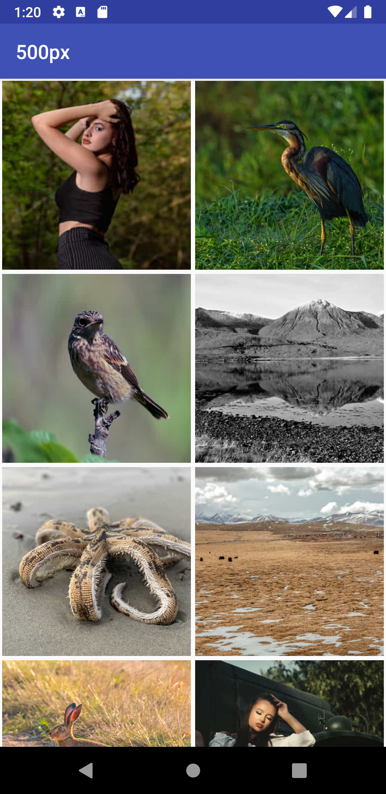

# 500px Android Developer Coding Challenge

It was a fun and easy challenge to create a photo app using the 500px GET API https://github.com/500px/legacy-api-documentation/blob/master/endpoints/photo/GET_photos.md. 
First screen should display a grid of images and clicking on any image should display the details with a full screen view of the image.

The app has been developed in Kotlin using coroutines, okHttp, retrofit, Android Architecture Components and MVVM architecture.

# Features:

1. Display a grid of most popular images using the 500px GET Photos API. I have sorted the images based on the created_at time.
2. Implement infinite scrolling by using the paging library. The library loads 20 images at a time and loads more as the user scrolls down. 
3. Swipe to refresh: When the user swipes down on the grid layout it will reload the data and load in new data from the backend.
4. Display enlarged image and basic information such as title of the image and description. I have used a DialogFragment to display full screen view of the image while maintaining the aspect ratio of the image. 

Note: Reason behind the design decisions: 
The images should be the main focus of an images app. Therefore I have kept the background black. I also decided to display the details in a semi transparent gray box in order minimize the image area covered by the text.  
I have also used dimens.xml, colors.xml, styles.xml and strings.xml to make it easier to change the theme of the app whenever required.

# Consumer Key
The consumer key has been added to a file called `apikey.properties`. This file is part of gitignore and will not be in source control. During the build process the build gradle reads this file. During the GET Photos API call the consumer key is read from the build config.

Note: I have tested the app without the consumer key and it looks like the API is still returning the photos in the response. But in real world situation the API should not return a successful response. The app already has been enabled with error handling and will display a snack bar with the error message.

# Architecture and Folder Organization:
For this coding challenge, I used MVVM architecture and used live data to update UI based on change of data. I prefer MVVM architecture over other architecture patterns such as MVC, MVI or MVP because it provides a clear separation between views, repositories and models. There is also a component called ViewModel that helps update the view based on changes in live data. Another reason for selecting MVVM architecture is each component is only resposible for a particular task without having to worry about the other components. 

Package structure that I used for this app is described below: 
1. apis: This package includes Retrofit Builder to make and establish the network connection. There is another file which holds the API interface to make the GET API call. Lastly, there is sealed class to format the result of the API call so that the UI can handle the API response. 
2. model: This package includes all the serialized data classes based on the API response. In future it will also hold the data classes for API requests. 
3. repositories: This package includes the repository for the app as well as the data source files. 
4. ui: This package includes sub packages for activities, fragments, viewmodels and adapters to hold files respectively. In addition to that it also holds UI files which can be used throughout the app. For example: SquareGalleryLayout, ZoomOutPageTransformer.
5. Lastly, there is a file called Constants in the main app package. This file contains all the constants that the app will use for proper functioning. Note: This does not include any string constants. Strings should always be in strings.xml which makes it easier for localizations.

Note the reason behind the architecture decision of using shared viewmodel between the activity and the fragment: If the user clicks on an image it should open the detailed view. However when the user clicks back I wanted to retail the user position on the grid view. Therefore the best and most optimal solution was to share viewmodel between the fragment and the activity. The Fragment reads from the same gallerylist as the activity and the user position is retained on the grid layout when the user presses the back button. The user can also scroll left and right through the list in the detailed view without losing the image position in the grid layout. 
